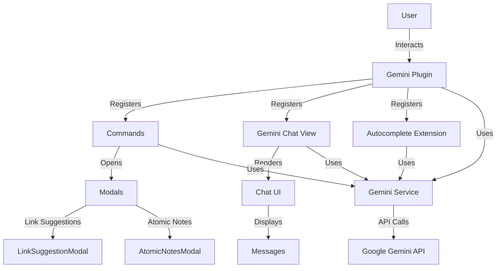

# Architecture Documentation

## Overview

Obsidian Gemini Assistant is a TypeScript-based Obsidian plugin that integrates Google's Gemini AI for intelligent knowledge management features including real-time autocomplete, smart retrieval, and note analysis.

## System Architecture



## Component Breakdown

### 1. Plugin Core (`main.ts`)

**Responsibilities**:
- Plugin lifecycle management (`onload`, `onunload`)
- Command registration
- View registration
- Settings management
- CodeMirror extension registration

**Commands Registered**:
1. `gemini-assist` - Open chat view
2. `gemini-generate-selection` - Generate from text selection
3. `gemini-suggest-links` - Suggest wikilinks for paragraph
4. `gemini-atomic-notes` - Refactor into atomic notes
5. `gemini-graph-synthesis` - Generate graph summary

**Design Pattern**: **Facade Pattern**
- Provides simple interface to complex subsystems

### 2. Gemini Service (`GeminiService.ts`)

**Responsibilities**:
- Wrapper around Google Generative AI SDK
- Model initialization (`gemini-2.0-flash` with fallback)
- Content generation
- Error handling
- Model fallback logic

**Key Methods**:
```typescript
initializeModel(): void
generateContent(prompt: string): Promise<string>
```

**Design Pattern**: **Adapter Pattern**
- Adapts Gemini API to plugin's needs

### 3. Chat View (`GeminiView.ts`)

**Responsibilities**:
- Chat UI rendering
- Message management (user/bot/system)
- Smart Retrieval (2-Pass RAG)
- Context targeting (@Mentions parsing)
- Message rendering with MarkdownRenderer
- "Save as Note" functionality

**Key Features**:
- **Smart Retrieval Flow**:
  1. Parse @Mentions for context filtering
  2. Ask Gemini to identify relevant notes
  3. Read identified notes for context
  4. Send final prompt with context
- **Component-based Markdown Rendering**:
  - Creates `Component` per message
  - Enables clickable internal links

**Design Pattern**: **Model-View-Controller (MVC)**
- View handles UI, delegates logic to services

### 4. Autocomplete Extension (`AutocompleteExtension.ts`)

**Responsibilities**:
- CodeMirror 6 extension for ghost text
- Suggestion state management
- Ghost text decoration rendering
- Keyboard shortcuts (Tab/Escape)
- Debounced API requests

**Architecture**:
```typescript
StateField<Suggestion>      // Stores suggestion data
StateField<DecorationSet>   // Stores ghost text decoration
ViewPlugin                  // Listens to editor changes
Keymap                      // Handles Tab/Escape
```

**Key Flow**:
1. User types → `ViewUpdate` triggered
2. Debounce 600ms
3. Construct FIM prompt (text before + after cursor)
4. Call Gemini API
5. Display ghost text via `Decoration.widget`
6. Tab → Accept, Escape → Dismiss

**Design Patterns**:
- **Observer Pattern**: ViewPlugin observes editor changes
- **State Pattern**: Different states for suggestion (null, active)
- **Decorator Pattern**: Ghost text as decoration

### 5. Modals

#### LinkSuggestionModal (`LinkSuggestionModal.ts`)
**Purpose**: Display and select link suggestions
**UI**: Toggle list of suggested links
**Output**: Array of selected link objects

#### AtomicNotesModal (`AtomicNotesModal.ts`)
**Purpose**: Preview and select atomic notes
**UI**: Toggle list of concepts + MOC option
**Output**: Array of selected notes + MOC flag

**Design Pattern**: **Template Method Pattern**
- Both extend `Modal` with similar structure

### 6. Settings (`Settings.ts`)

**Responsibilities**:
- Settings UI rendering
- Settings persistence
- Field validation

**Settings**:
- `apiKey`: string
- `systemPrompt`: string
- `noteTemplate`: string
- `enableAutocomplete`: boolean
- `autocompleteDelay`: number

## Data Flow

### Chat Message Flow

```
User Input
    ↓
Parse @Mentions → Filter Files
    ↓
Smart Retrieval (2-Pass RAG)
    ↓
Construct Final Prompt
    ↓
Gemini API Call
    ↓
Render Response (Markdown + Components)
    ↓
Display in Chat UI
```

### Autocomplete Flow

```
User Types
    ↓
ViewUpdate Event
    ↓
Clear Existing Suggestion
    ↓
Debounce 600ms
    ↓
Construct FIM Prompt
    ↓
Gemini API Call (Gemini 1.5 Flash)
    ↓
Clean Suggestion
    ↓
Display Ghost Text
    ↓
Tab → Insert Text
Escape → Dismiss
Move Cursor → Dismiss
```

## Design Principles Applied

### 1. **Separation of Concerns**
- UI (View) separate from business logic (Service)
- Commands separate from implementation
- Each file has clear responsibility

### 2. **Dependency Injection**
- `GeminiView` receives `GeminiService` and `Plugin`
- `AutocompleteExtension` receives service and config functions
- Modals receive app and data

### 3. **Single Responsibility Principle (SRP)**
- `GeminiService` → Only API communication
- `GeminiView` → Only UI and rendering
- `AutocompleteExtension` → Only autocomplete logic
- Modals → Only user selection

### 4. **Open/Closed Principle**
- Easy to add new commands without modifying core
- Easy to add new modal types
- Extension system for autocomplete

### 5. **DRY (Don't Repeat Yourself)**
- Reusable `GeminiService` across all features
- Shared modal patterns
- Centralized constants (could be improved)

## Performance Optimizations

### 1. **Debouncing**
- Autocomplete requests debounced by 600ms
- Prevents API spam

### 2. **Request Cancellation**
- `AbortController` cancels stale autocomplete requests
- Saves API quota

### 3. **Context Limiting**
- Autocomplete: Max 2000 chars before, 500 after
- Retrieval: Max 3 notes, 1500 chars each
- Graph synthesis: Max 10 notes, 1000 chars each

### 4. **Lazy Loading**
- Views registered but not loaded until activated
- Modals created on-demand

### 5. **CodeMirror Optimization**
- State Fields only update on relevant changes
- Decorations use `map()` for efficient updates
- High-priority keymap prevents unnecessary processing

## Security Considerations

### 1. **API Key Storage**
- Stored in Obsidian's secure settings
- Not exposed in logs or UI

### 2. **Input Validation**
- User input sanitized before API calls
- JSON parsing with error handling

### 3. **Error Handling**
- Try-catch blocks around all API calls
- User-friendly error messages
- No sensitive data in error messages

## Future Improvements

### Suggested Refactorings

1. **Extract Constants**
   - Create `Constants.ts` for magic numbers
   - Centralize model names, delays, limits

2. **Extract Prompt Templates**
   - Create `PromptTemplates.ts`
   - Use template functions with parameters

3. **Create ContextStrategy**
   - Interface for different context strategies
   - Implementations: `EntireVaultStrategy`, `FolderStrategy`, `TagStrategy`

4. **Create ModalFactory**
   - Centralize modal creation
   - Reduce code duplication in `main.ts`

5. **Create RetrievalService**
   - Extract RAG logic from `GeminiView`
   - Make it reusable across features

6. **Add Unit Tests**
   - Test service layer
   - Test prompt construction
   - Test context filtering

### Potential Features

1. **Embeddings-based RAG**
   - Use Google Embedding API
   - Semantic search within note content
   - Local vector store

2. **Contradiction Detection**
   - Compare notes on similar topics
   - Identify inconsistencies

3. **Canvas Generation**
   - Create mind maps from AI analysis
   - Visual representation of concepts

4. **Custom Model Selection**
   - Let users choose Gemini model
   - Trade-off speed vs quality

## API Reference

### GeminiService

```typescript
class GeminiService {
    constructor(apiKey: string)
    initializeModel(): void
    generateContent(prompt: string): Promise<string>
}
```

### AutocompleteExtension

```typescript
function createAutocompleteExtension(
    service: GeminiService,
    enabled: () => boolean,
    delay: () => number
): Extension
```

### Modals

```typescript
class LinkSuggestionModal extends Modal {
    constructor(app: App, suggestions: LinkSuggestion[])
    onOpen(): void
}

class AtomicNotesModal extends Modal {
    constructor(app: App, notes: AtomicNote[])
    onOpen(): void
}
```

## Dependencies

```json
{
  "obsidian": "^1.4.11",
  "@google/generative-ai": "^0.21.0",
  "@codemirror/state": "^6.4.0",
  "@codemirror/view": "^6.23.0"
}
```

## Build Pipeline

```
TypeScript (.ts)
    ↓
tsc (type checking)
    ↓
esbuild (bundling)
    ↓
main.js (output)
```

**Build Config**:
- Target: ES2022
- Module: ESNext
- External: obsidian, @codemirror/*

---

**Last Updated**: 2025-11-19
**Version**: 2.0.6
